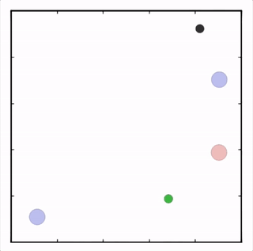
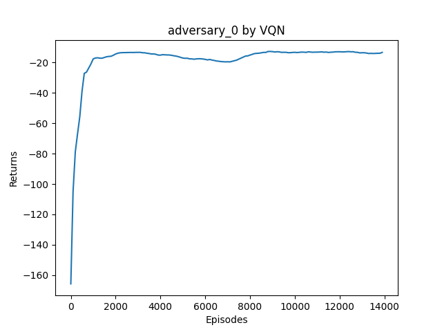
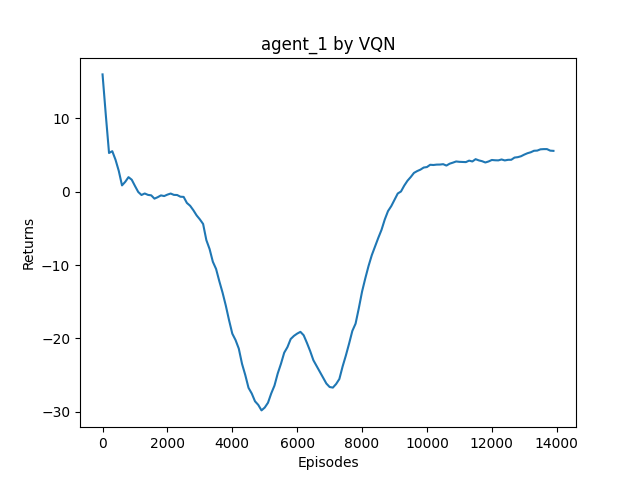
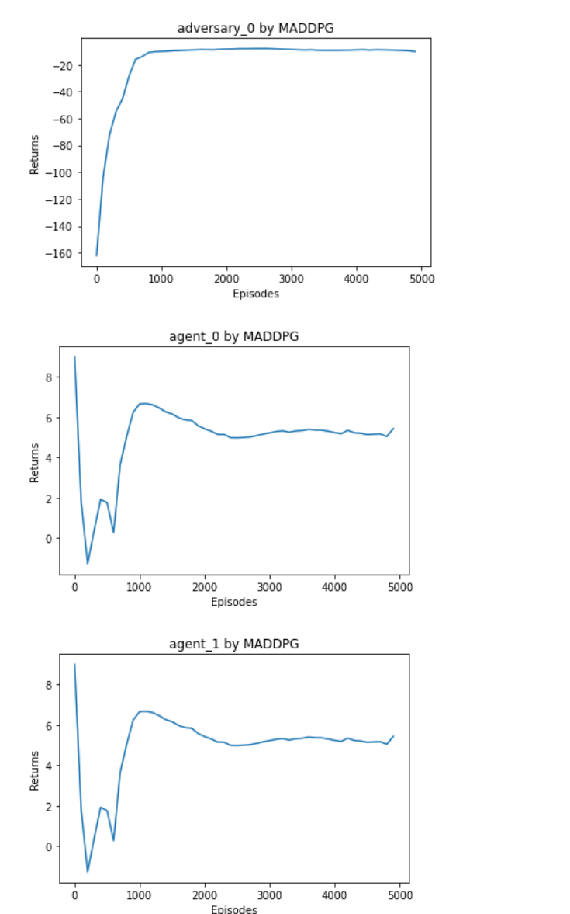

# 1. 笔记说明

一共有五篇

- 多智能体强化学习基本概念
- 多智能体的通信方式
- IPPO
- MADDPG
- VDN

## 参考资料

- 《多智能体强化学习基本概念》与《多智能体的通信方式》是学习了B站视频王树森的《深度强化学习》的P22与P23，主要是了解了一些基本的概念（[【王树森】深度强化学习(DRL)_哔哩哔哩_bilibili](https://www.bilibili.com/video/BV12o4y197US/?spm_id_from=333.788.recommend_more_video.0&vd_source=bb3a60ee7100e887ed764d54daed9f8e)）

- IPPO与MADDPG是阅读了《动手学深度强化学习》中的IPPO与MADDPG的网页拷贝（[多智能体强化学习进阶 (boyuai.com)](https://hrl.boyuai.com/chapter/3/多智能体强化学习进阶)）
- VDN是参考了知乎的论文阅读做的笔记（[VDN算法解析: Value-Decomposition Networks For Cooperative Multi-Agent Learning - 知乎 (zhihu.com)](https://zhuanlan.zhihu.com/p/362191316?utm_id=0)）

# 2.代码说明

代码一共有三部分

- IPPO
- MADDPG
- VDN

其中IPPO与MADDPG就是《动手学深度强化学习》里的源代码，而VDN是在MADDPG的框架上，结合了VDN的论文解析自己复现的，其实我也去找了一些Github上的VDN代码来看，但是很多都是多算法集合，可读性不高。再加上很多都使用了SMAC的环境，并且这个环境现在已经不维护了，我怎么下载都不成功（似乎是windows的问题？），因此没能跑通代码，没法更清楚地弄懂代码运行的过程。因此我就自己复现了，目前来看似乎复现的效果还不错。

# 3.VDN代码复现效果说明

## 3.1 环境说明

环境我采用的是MPE 中的`simple_adversary`环境作为代码实践的示例，如图所示。该环境中有 1 个红色的对抗智能体（adversary）、个蓝色的正常智能体，以及个地点（一般），这个地点中有一个是目标地点（绿色）。这个正常智能体知道哪一个是目标地点，但对抗智能体不知道。正常智能体是合作关系：它们其中任意一个距离目标地点足够近，则每个正常智能体都能获得相同的奖励。对抗智能体如果距离目标地点足够近，也能获得奖励，但它需要猜哪一个才是目标地点。因此，正常智能体需要进行合作，分散到不同的坐标点，以此欺骗对抗智能体。

## 3.2 复现效果

我们将对抗智能体的算法设置为DQN，将两个正常智能体的算法设置为VDN

复现的效果如下图所示

- 首先是对抗智能体的奖励图

  

- 接下来是正常智能体的奖励图

  

  

  可以看到正常智能体最终保持了正向的回报，说明它们通过合作成功地占领了两个不同的地点，进而让对抗智能体无法知道哪个地点是目标地点。

- 与MADDPG对比

  

  与MADDPG的效果进行对比，可以发现最后的收敛效果VDN还算不错，但是需要训练的局数会更多一些。

# 4.需要改进的问题

**问题1**：环境问题

mpe使用的是旧环境，我使用的mpe的版本是比较早的，目前官方已经不维护了，官方已经将mpe环境迁移到了PettingZoo当中，并且这个版本要求gym的版本为10.1.5，这肯定和joyrl是不兼容的，后续需要改为新版本。

我之前曾尝试将MADDPG的代码改到新版本上，新旧比较大的区别就是返回的观测值、奖励、动作之类的信息格式完全不一样，需要进行修改。但是我修改之后MADDPG直接不收敛了，后续需要进一步排查问题所在

**问题2**：代码问题

目前的代码复用性不高，问题主要在于不能随意指定VDN的智能体数量，后续需要进一步修改，以便更好地整合到joyrl中