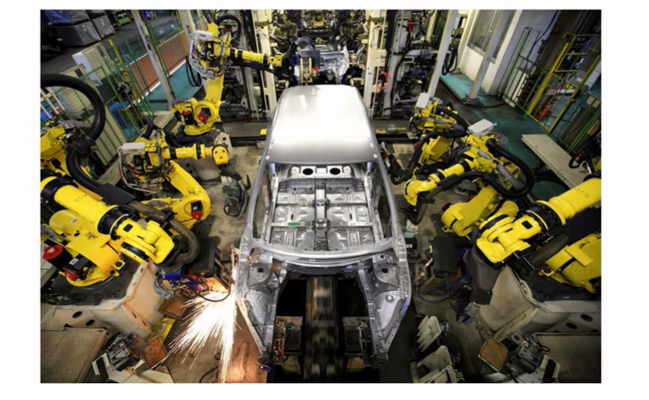
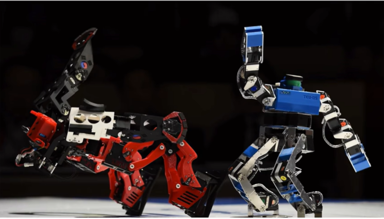
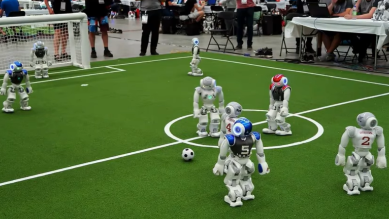
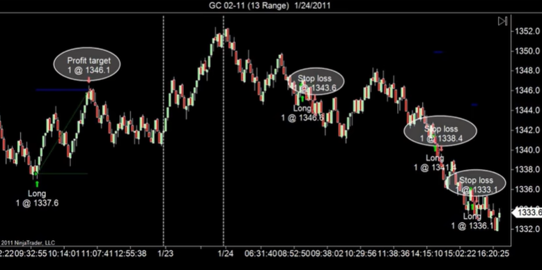
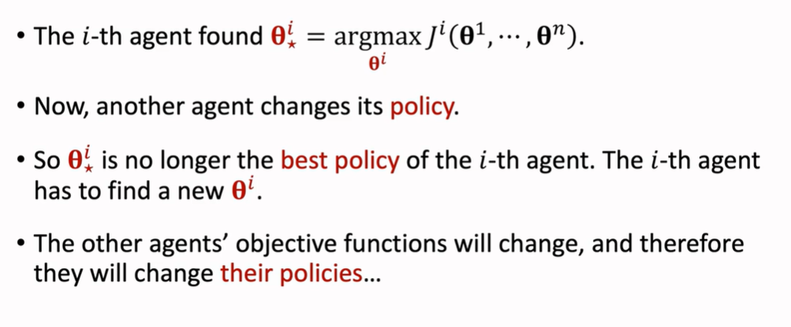

# 多智能体强化学习基本概念

# 1.多智能体强化学习的常见设定

多智能体有常见的四种设定：

- Fully cooperative（合作关系）
- Fully competitive（竞争关系）
- Mixed Cooperative & competitive（合作与竞争混合）
- Self-interested（利己主义）

## 1.1 Fully cooperative

所有智能体的利益一致，获得的奖励相同，它们有共同的目标。

例子：多个机械手臂共同装配汽车

## 1.2 Fully Competitive

一个智能体的奖励是另外一个智能体的损失。

例子：零和博弈（奖励之和为0）

捕猎（捕猎不算是零和博弈，猎豹的损失小于小鹿的奖励）

## 1.3 Mixed Cooperative & Competitive

同时存在竞争与合作。

例子：足球比赛，队友之间是合作，两只球队之间是竞争

## 1.4 self-interested

每个智能体只考虑自己，但是它们的行为会影响其它智能体

例子：股票交易系统，每一个系统都是最大化自己的收益，但是不会刻意地去帮助别人，但是每个系统都会影响其他系统，因此无法看作单智能体问题

无人驾驶

# 2. 多智能体的专业术语

## 2.1 基本符号标记

- 假设有$n$个智能体

- 用$S$表示状态

- 用$A^i$表示第$i$个智能体的动作（大写表示随机变量，小写表示观测值）

- 状态转移表示如下
  $$
  p(s'|s,a^1,\cdots,a^n)=\mathbb{P}(S'=s'|S=s,A^1=a^1,\cdots,,A^n=a^n).
  $$
  $\mathbb{P}$是条件概率密度函数，给定状态$s$与$a^1,a^2,\cdots,a^n$，$\mathbb{P}$函数输出下一个状态$s'$的概率值为$p$

  从这里也可以看出多智能体系统的一个难点：下一个状态会受到所有智能体动作的影响

**奖励**

- 用$R^i$表示第$i$个智能体获得的奖励
  - 合作关系：$R^1=R^2=\cdots=R^n$
  - 竞争关系：$R^1\propto -R^2$
- 一个智能体的奖励不仅取决于自己的动作$A^i$,同时也取决于其他智能体的动作${A^j}_{j\neq i}$
  - 例如足球比赛，你什么都没做，但是你队友进了一个乌龙球，那么你就会得到一个负奖励

**回报**

- 用$R^i_t$表示第$i$个智能体在时间$t$获得的奖励

- 回报用$U^i_t$表示第$i$个智能体在时间$t$的回报
  $$
  U^i_t=R^i_t+R^i_{t+1}+R^i_{t+2}+R^i_{t+3}+\cdots
  $$
  

- 折扣回报：引入折扣因子
  $$
  U^i_t=R^i_t+\gamma \cdot R^i_{t+1}+\gamma^2 \cdot R^i_{t+2}+\gamma^3 \cdot R^i_{t+3}+\cdots
  $$
  

## 2.2 策略网络

策略网络是用神经网络来近似智能体的策略函数

- 用$\theta^i$表示第$i$个智能体的策略网络的参数
- 第$i$个智能体的策略网络表示为 $\pi(a^i|s;\theta^i)$
  - 在某些情况下策略网络是可以互换的：$\theta^1=\theta^2=\cdots=\theta^n$
    - 无人驾驶的每个车可能都有相同的策略
  - 在很多情况下，策略网络是不可以互换的：$\theta^i \neq \theta^j$
    - 例如足球机器人中，有些球员是负责进攻，有些球员是负责防守的，这时候二者的策略就不同

## 2.3 回报中随机性的来源

- 奖励$R^i_t$受状态$S_t$与动作$A^1_t,A^2_t,A^3_t,\cdots ,A^n_t$的影响
- $S_t$的随机性来源于状态转移函数$p$
- $A_t^i$的随机性来源于策略网络$\pi(\cdot|s_t;\theta^i)$

因此，回报$U_{t}^{i}=\sum_{k=0}^{\infty}\gamma^{k}\cdot R_{t+k}^{i}$受到以下的影响：

- 未来的所有状态：$\{S_t,S_{t+1},S_{t+2},\cdots\};$
- 未来的所有动作：$\bigl\{A_{t}^{i},A_{t+1}^{i},{A_{t+2}^{i}},\cdots\bigr\},\text{for all }i=1,\cdots,n.$

## 2.4 状态价值函数

- 第$i$个智能体的状态价值函数表示为：
  $$
  V^i(s_t;\theta^1,\cdots,\theta^n)=\mathbb{E}\big[U_t^i\mid S_t=s_t\big].
  $$

- 用期望消除了$s_t$以外的所有状态和所有动作

- 状态价值函数的随机性来源于动作：$A_{t}^{j}\sim\pi\big(\cdot\mid s_{t};\mathbf{\theta}^{j}\big),\text{for all}j=1,\cdots,n.$

  （这也是为什么状态价值函数与$\theta^1,\theta^2,\cdots,\theta^n$有关系，即一个状态价值函数与所有智能体的策略有关）

- 如果一个智能体改变了他的策略，那么所有的状态价值函数$V^1,V^2,\cdots,V^n$都会改变

  - 例子：例如在足球比赛中，一个前锋改进了他的策略而其他所有人的策略不变
  - 他的所有队友的状态价值函数的值都会提高
  - 他的所有对手的状态价值函数的值都会降低

# 3.多智能体的收敛问题

收敛：无法改进策略来获得更大的回报

## 3.1 单智能体的收敛问题

- 策略网络：$\pi(a|s;\theta)$
- 状态价值函数：$V(s;\theta)$
- 用$J(\theta)=E_S[V(S;\theta)]$来表示策略的好坏

- 通过训练策略网络的参数$\theta$来获得
  $$
  \max\limits_{\mathbf{\theta}}J(\mathbf{\theta}).
  $$
  

- **收敛**：$J(\theta)$停止增长

## 3.2 纳什均衡

- 当其他智能体的策略保持不变，第$i$个智能体无法通过改进其策略来获得更好的期望回报（纳什均衡）
- 每一个智能体都采取了针对其他智能体的策略的最好策略
- 纳什均衡可以代表收敛是因为所有的智能体都没有动力去改进自己的策略（改进策略无法增加收益）

# 4.多智能体强化学习的困境

- 直接套用单智能体的算法存在问题：永远也无法收敛

