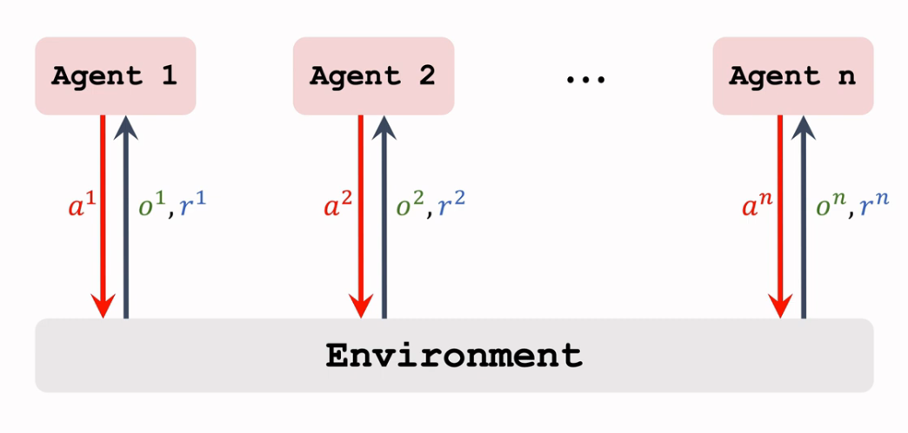
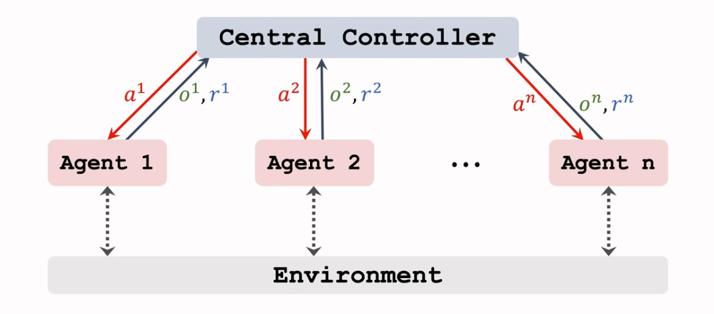
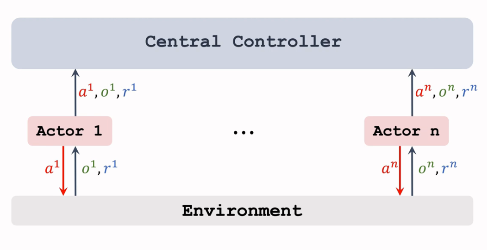
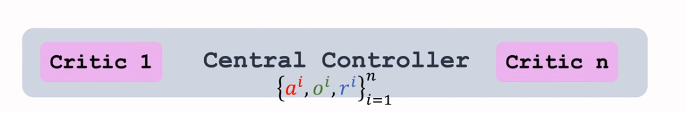
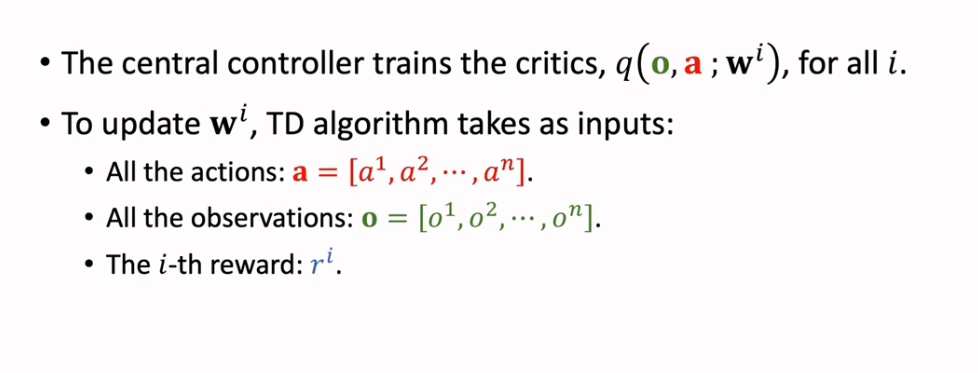
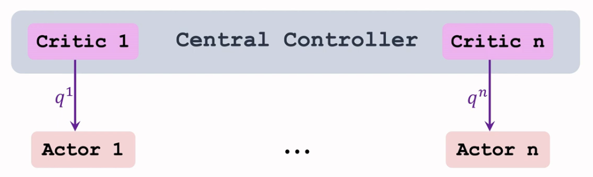
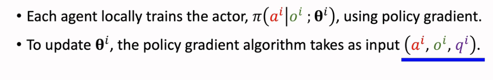
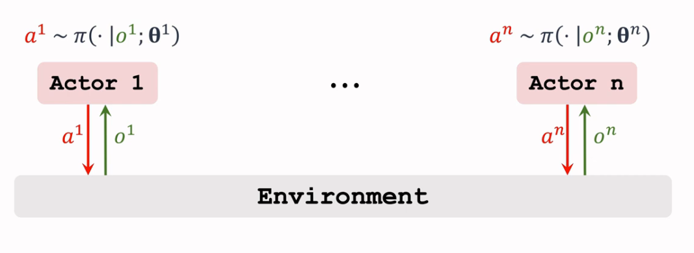
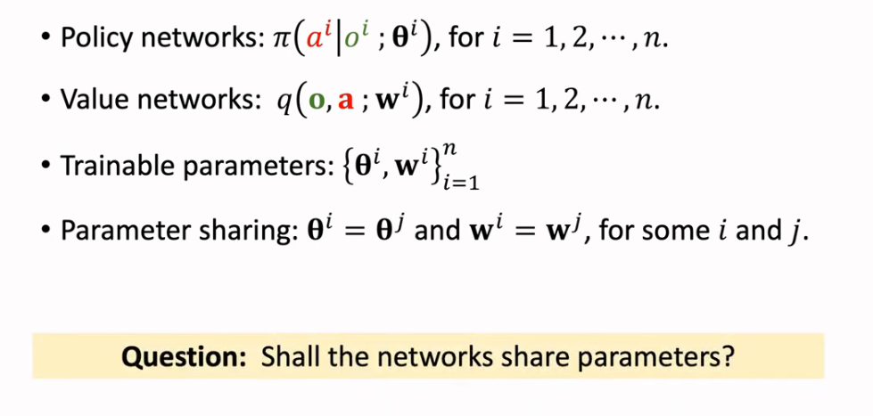

# 多智能体的通信方式

# 1.三种常见的架构

多智能体的通信有三种常见的架构

- 完全去中心化（Fully decentralized）

  每个智能体使用自己的观察和奖励来学习其策略。智能体之间不通信。

- 完全中心化（Fully centralized）

  智能体将所有内容发送到中心控制器。控制器为所有智能体做出决策。

- 中心化训练去中心化执行（centralized training with decentralized execution）

  在训练期间使用中央控制器。控制器在决策时被禁用，用自己的策略进行决策

# 2.部分观测

- 一个智能体可能无法观测到状态的所有值
- 用$o^i$表示第$i$个智能体的观测值
- 部分观测：$o^i\neq s$
- 完全观测：$o^1 = o^2=\cdots=o^n=s$

# 3.去中心化

每个智能体都是用单智能体强化学习的直接应用

- 第$i$个智能体拥有策略网络（actor）：$\pi(a^i|o^i;\theta^i)$
- 第$i$个智能体拥有价值网络（critic）：$q(o^i,a^i;w^i)$
- 智能体之间不共享观测与动作
- 用单智能体强化学习的方法来训练两个网络

**这种方法效果不好，原因是每个智能体还受其他智能体的影响，不可以完全忽视**

# 4.完全中心化

**集中训练：**训练由控制器执行。

- 控制器知道所有的观察、行动和奖励。
- 使用策略梯度训练$\pi(a^i|o;\theta^i)$
- 使用 TD 算法训练 $q(o,a;w^i)$

**集中执行：**决策由控制器做出

- 对于所有智能体，第$i$个智能体将其观察结果$o^i$发送给控制器。
- 控制器知道 $o = [o^1， o^2,\cdots, o^n] $
- 对于所有 智能体，控制器通过采样操作获得$a^i\sim \pi(\cdot|o;\theta^i)$，并将$a^i$发送给第 $i$个智能体。

## 4.1 中心化的缺点

最大的缺点是执行速度慢

- 发送信息要需要时间
- 执行动作需要同步，所以要等最慢的智能体

# 5.中心化训练去中心化执行

- 每个智能体都有自己的策略网络（actor）：$\pi(a^i|o^i;\theta^i)$
- 中央控制器有n个值网络（critic）：$q(o,a;w^i)$
- **集中训练：**在训练期间，中央控制器知道所有智能体的观察，行动和奖励。
- **分散执行：**在执行过程中，不使用中央控制器及其价值网络。

## 5.1 中心化训练

之后将$q$值发送给各个智能体

## 5.2 去中心化执行

# 6. 参数共享

是否共享参数取决于具体问题：

- 足球比赛中不同智能体有不同功能，不可以共享参数
- 无人驾驶中可以共享参数