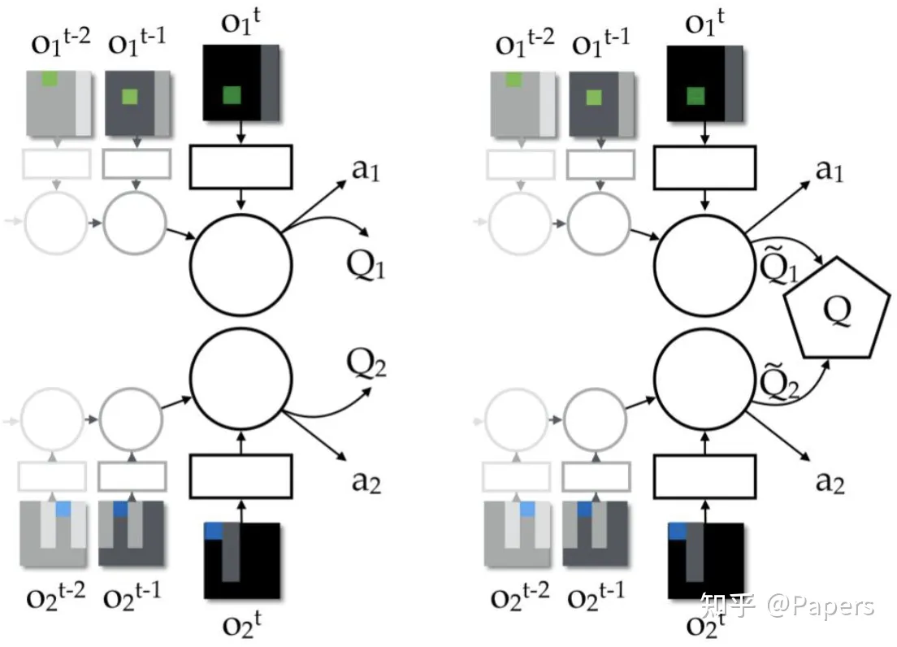

# VDN

# 1.算法详解

## 1.1 Q函数值分解

假设 $Q((h^1,h^2,\cdots,h^d),(a^1,a^2,\cdots,a^d))$ 是多智能体团队的整体Q函数，$d$是智能体个数， $h^i$ 是智能体$i$ 的历史序列信息， $a^i$ 是其动作。该Q函数的输入集中了所有智能体的观测和动作，可通过团队奖励 $r$ 来迭代拟合。为了得到各个智能体的值函数，作者提出如下假设：
$$
Q((h^1,h^2,\cdots,h^d),(a^1,a^2,\cdots,a^d))\approx\sum_{i=1}^d\tilde{Q}_i(h^i,a^i).(1)
$$


该假设表明团队的Q函数可以通过求和的方式近似分解成 $d$ 个子Q函数，分别对应$d$个不同的智能体，且每个子Q函数的输入为该对应智能体的局部观测序列和动作，互相不受影响，如下图所示：



​																				图1. 左图：independent RL; 右图：VDN值分解。	

这样，每个智能体就有了自己的值函数，它们就可以根据自己的局部值函数来进行决策了：
$$
a^i = arg max_{a^{i^‘}}\tilde{Q}_i(h^i,a^i)
$$


需要注意的是，这里的$\tilde{Q}_i(h^i,a^i)$ 并不是任何严格意义上的Q值函数。因为并没有理论依据表明一定存在一个reward函数，使得该 $\tilde{Q}_i$满足贝尔曼方程。

## 1.2 分解的前提

事实上，(1)式若成立应至少满足一个条件：
$$
r(\boldsymbol{s},\boldsymbol{a})=\sum_{i=1}^d r(o^i,a^i).
$$


其中， $s$表示系统全局状态，$a$ 表示智能体联合动作。(3)式表明团队的整体奖励应由所有智能体各自的奖励函数求和得到。然而，即使这个条件成立，根据文章中的证明，Q函数的分解也应该写成：$Q(s,\boldsymbol{a})=\sum_{i=1}^d Q_i(\boldsymbol{s},\boldsymbol{a})$。子Q函数的输入应该还是全局状态 $s$和联合动作 $a$ ，而不是 (1) 式中的形式。

所以，此处的bug是VDN算法的硬伤所在，作者也因此将每个智能体历史状态、动作、奖励的序列信息作为其值函数 $\tilde{Q}_i(h^i,a^i)$的输入，以此弥补局部观测上的不足。

但是无论如何，这样的设定使得每个智能体不会共享同一个值函数，在一定程度上缓解了credit assignment问题。

除此之外，VDN的结构还能实现端到端的训练。VDN在集中式训练的时候，只需要计算整体Q函数的TD-error，然后将误差反向传播给各个子Q函数，大大减少了计算量。

## 1.3 参数共享

和COMA算法一样，为了减少训练参数，作者也同样考虑了将智能体的参数进行共享。参数共享的一个好处就是能够避免惰性智能体的出现。

具体要实现参数共享，便是让所有的智能体共用一个决策网络。在我的程序设计中，是让n个智能体共用一个决策网络，同时智能体各自拥有一个target网络。

# 2. 代码实践

## 2.1 环境导入

首先需要拷贝mpe环境然后下载进自己的python环境（方法很多，也可以参考GitHub上的来操作）

```bash
!git clone https://github.com/boyu-ai/multiagent-particle-envs.git --quiet
!pip install -e multiagent-particle-envs
```

接下来要把gym的环境更改为`gym==0.10.5`

```bash
pip uninstall gym
pip install gym==0.10.5
```

## 2.2 定义缓存区

这边主要是多了一个多智能体的缓存区，因为其动作是多个智能体的动作，所以稍微修改了以下，这也是后续需要修改的（改为对n个智能体适用）

```python
import collections
import random
import numpy as np


'''定义经验回放池'''

# 1. 单智能体
class ReplayBuffer:
    ''' 经验回放池 '''
    def __init__(self, capacity):
        self.buffer = collections.deque(maxlen=capacity)  # 队列,先进先出

    def add(self, state, action, reward, next_state, done):  # 将数据加入buffer
        self.buffer.append((state, action, reward, next_state, done))

    def sample(self, batch_size):  # 从buffer中采样数据,数量为batch_size
        transitions = random.sample(self.buffer, batch_size)
        state, action, reward, next_state, done = zip(*transitions)
        return np.array(state), action, reward, np.array(next_state), done

    def size(self):  # 目前buffer中数据的数量
        return len(self.buffer)

# 2. 多智能体 
class MAReplayBuffer:
    ''' 经验回放池 '''
    def __init__(self, capacity):
        self.buffer = collections.deque(maxlen=capacity)  # 队列,先进先出

    def add(self, state, action1,action2, reward, next_state, done):  # 将数据加入buffer
        self.buffer.append((state, action1,action2 ,reward, next_state, done))

    def sample(self, batch_size):  # 从buffer中采样数据,数量为batch_size
        transitions = random.sample(self.buffer, batch_size)
        state, action1,action2, reward, next_state, done = zip(*transitions)
        return np.array(state), action1,action2, reward, np.array(next_state), done

    def size(self):  # 目前buffer中数据的数量
        return len(self.buffer)
```


## 2.3 定义DQN

将对抗智能体的算法设定为DQN，这是因为VDN是由DQN修改过来

```python
import torch
import torch.nn as nn
import torch.nn.functional as F
import numpy as np
import random


'''定义DQN'''
    
class Qnet(torch.nn.Module):
    ''' 只有一层隐藏层的Q网络 '''
    def __init__(self, state_dim, hidden_dim, action_dim):
        super(Qnet, self).__init__()
        self.fc1 = torch.nn.Linear(state_dim, hidden_dim)
        self.fc2 = torch.nn.Linear(hidden_dim, action_dim)

    def forward(self, x):
        x = F.relu(self.fc1(x))  # 隐藏层使用ReLU激活函数
        return self.fc2(x)
    
class DQN:
    ''' DQN算法 '''
    def __init__(self, state_dim, hidden_dim, action_dim, learning_rate, gamma,
                 epsilon, target_update, device):
        self.action_dim = action_dim
        self.q_net = Qnet(state_dim, hidden_dim,
                          self.action_dim).to(device)  # Q网络
        # 目标网络
        self.target_q_net = Qnet(state_dim, hidden_dim,
                                 self.action_dim).to(device)
        # 使用Adam优化器
        self.optimizer = torch.optim.Adam(self.q_net.parameters(),
                                          lr=learning_rate)
        self.gamma = gamma  # 折扣因子
        self.epsilon = epsilon  # epsilon-贪婪策略
        self.target_update = target_update  # 目标网络更新频率
        self.count = 0  # 计数器,记录更新次数
        self.device = device

    def take_action(self, state):  # epsilon-贪婪策略采取动作
        if np.random.random() < self.epsilon:
            action = np.random.randint(self.action_dim)
            # # 将action转换为独热编码
            # action = np.eye(self.action_dim)[action]
        else:
            state = torch.tensor([state], dtype=torch.float).to(self.device)
            action = self.q_net(state).argmax().item()
            # # 将action转换为独热编码
            # action = np.eye(self.action_dim)[action]
        return action

    def update(self, transition_dict):
        states = torch.tensor(transition_dict['states'],
                              dtype=torch.float).to(self.device)
        actions = torch.tensor(transition_dict['actions']).view(-1, 1).to(
            self.device)
        rewards = torch.tensor(transition_dict['rewards'],
                               dtype=torch.float).view(-1, 1).to(self.device)
        next_states = torch.tensor(transition_dict['next_states'],
                                   dtype=torch.float).to(self.device)
        dones = torch.tensor(transition_dict['dones'],
                             dtype=torch.float).view(-1, 1).to(self.device)

        q_values = self.q_net(states).gather(1, actions)  # Q值
        # 下个状态的最大Q值
        max_next_q_values = self.target_q_net(next_states).max(1)[0].view(
            -1, 1)
        q_targets = rewards + self.gamma * max_next_q_values * (1 - dones
                                                                )  # TD误差目标
        dqn_loss = torch.mean(F.mse_loss(q_values, q_targets))  # 均方误差损失函数
        self.optimizer.zero_grad()  # PyTorch中默认梯度会累积,这里需要显式将梯度置为0
        dqn_loss.backward()  # 反向传播更新参数
        self.optimizer.step()

        if self.count % self.target_update == 0:
            self.target_q_net.load_state_dict(
                self.q_net.state_dict())  # 更新目标网络
        self.count += 1

```

## 2.4 定义VDN

VDN重点如下：

- 输入的Qnet维度为智能体数量乘以状态空间的维度，这是为了能够接受全局的信息
- 每一个智能体都有一个`target_qnet`，但是所有智能体共用一个`eval_qnet`
- 计算loss的时候，需要将各个智能体的`q_value`加起来得到`q_values`，然后`next_q_values`也是各个智能体的`next_q_value`，然后求loss，最后再进行参数更新。

```python
class VDN:
    def __init__(self, agents_num, state_dim, hidden_dim, action_dim, learning_rate, gamma,
                  epsilon, target_update, device):

        # 智能体数量
        self.agents_num = agents_num
        # 状态维度
        self.state_dim = state_dim
        # 隐藏层维度
        self.hidden_dim = hidden_dim
        # 动作维度
        self.action_dim = action_dim
        # 学习率
        self.learning_rate = learning_rate
        # 折扣因子
        self.gamma = gamma
        # epsilon-贪婪策略
        self.epsilon = epsilon
        # 目标网络更新频率
        self.target_update = target_update
        # 设备
        self.device = device
        self.count = 0  # 计数器,记录更新次数
        
        Qnet_input_dim = state_dim * self.agents_num 

        # 神经网络
        # 所有智能体共用一个决策q网络，但是每个智能体有一个独立的target_q网络
        self.eval_qnet = Qnet(Qnet_input_dim, hidden_dim,
                          self.action_dim).to(device)   # 每个agent选动作的网络
        self.target_qnet = []
        for i in range(self.agents_num):
            self.target_qnet.append(Qnet(Qnet_input_dim, hidden_dim,
                          self.action_dim).to(device))  # 每个agent选动作的网络


       
        # 让target_net和eval_net的网络参数相同
        for i in range(self.agents_num):
            self.target_qnet[i].load_state_dict(self.eval_qnet.state_dict())

        self.optimizer = torch.optim.Adam(self.eval_qnet.parameters(), lr=self.learning_rate)

        print('Init alg VDN')

    def update(self, transition_dict):
        """更新Q网络参数"""
        states = torch.tensor(transition_dict['states'],
                              dtype=torch.float).to(self.device)
        actions1 = torch.tensor(transition_dict['actions1']).view(-1, 1).to(
            self.device)
        actions2 = torch.tensor(transition_dict['actions2']).view(-1, 1).to(
            self.device)
        rewards = torch.tensor(transition_dict['rewards'],
                               dtype=torch.float).view(-1, 1).to(self.device)
        next_states = torch.tensor(transition_dict['next_states'],
                                   dtype=torch.float).to(self.device)
        dones = torch.tensor(transition_dict['dones'],
                             dtype=torch.float).view(-1, 1).to(self.device)

        # 计算loss
        q_values_1 = self.eval_qnet(states)
        q_values_2 = self.eval_qnet(states)
        # 分别计算每个智能体的target_q值并加起来
        for i in range(self.agents_num):
            next_q_value= self.target_qnet[i](next_states)
            if i == 0:
                next_q_values = next_q_value
            else:
                next_q_values = next_q_values + next_q_value

        with torch.no_grad():
            max_next_q_values = next_q_values.max(dim=1)[0].unsqueeze(1) 
            target_q_values = rewards + (self.gamma * max_next_q_values * (1 - dones))
        # # detach()函数将target_q_values从计算图中分离出来，防止梯度传播
        # target_q_values = target_q_values.detach()
        # 获取对应的q值
        q_values1 = q_values_1.gather(1, actions1)
        q_values2 = q_values_2.gather(1, actions2)
        q_values = q_values1 + q_values2
        loss = nn.functional.mse_loss(q_values, target_q_values)

        # 反向传播更新参数
        self.optimizer.zero_grad()
        loss.backward()
        self.optimizer.step()
        

        # 更新target网络
        if self.count % self.target_update == 0:
            for i in range(self.agents_num):
                self.target_qnet[i].load_state_dict(self.eval_qnet.state_dict())
        self.count += 1
      


    def take_action(self, state):  # epsilon-贪婪策略采取动作
        if np.random.random() < self.epsilon:
            action = np.random.randint(self.action_dim)

        else:
            state = torch.tensor([state], dtype=torch.float).to(self.device)
            action = self.eval_qnet(state).argmax().item()

        return action
```

## 2.5 主函数

```python
import random
import gym
import numpy as np
import collections
from tqdm import tqdm
import torch
from torch import nn
import torch.nn.functional as F
import matplotlib.pyplot as plt
from multiagent.environment import MultiAgentEnv
import multiagent.scenarios as scenarios
# 自己定义的库
from vdn_net import VDN
from RepluBuffer import ReplayBuffer,MAReplayBuffer
from dqn_net import DQN
import rl_utils
print("package loaded")


'''导入环境'''
def make_env(scenario_name):
    # 从环境文件脚本中创建环境
    scenario = scenarios.load(scenario_name + ".py").Scenario()
    world = scenario.make_world()
    env = MultiAgentEnv(world, scenario.reset_world, scenario.reward,
                        scenario.observation)
    return env


env_id = "simple_adversary"
env = make_env(env_id)

state_dims = []
action_dims = []
for action_space in env.action_space:
    action_dims.append(action_space.n)

for state_space in env.observation_space:
    state_dims.append(state_space.shape[0])

print("state_dims:", state_dims)
print("action_dims:", action_dims)

'''定义测试函数'''
def evaluate(env_id, agent_adversary,agent_normal, n_episode=10, episode_length=25):
    # 对学习的策略进行评估,此时不会进行探索
    env = make_env(env_id)
    returns = np.zeros(len(env.agents))
    for _ in range(n_episode):
        state = env.reset()
        for t_i in range(episode_length):
            state_1 = state[0]
            state_2 = state[1]
            state_3 = state[2]
            state_normal = np.concatenate((state_2, state_3), axis=0)
            a_1 = agent_adversary.take_action(state_1)
            a_2 = agent_normal.take_action(state_normal)
            a_3 = agent_normal.take_action(state_normal)
            a_1_one_hot = np.eye(action_dims[0])[a_1]
            a_2_one_hot = np.eye(action_dims[1])[a_2]
            a_3_one_hot = np.eye(action_dims[1])[a_3]
            actions = [a_1_one_hot, a_2_one_hot, a_3_one_hot]
            state, rew, done, info = env.step(actions)
            rew = np.array(rew)
            returns += rew / n_episode
    return returns.tolist()

'''超参数设定'''
num_episodes = 14000
episode_length = 25  # 每条序列的最大长度
hidden_dim = 64
hidden_dim_vdn = 256
lr = 2e-3
lr_vdn = 1e-2
gamma = 0.95
gamma_vdn = 0.95
epsilon = 0.02
epsilon_vdn = 0.02
target_update = 10
buffer_size = 100000
minimal_size = 4000  # buffer中数据的最小数量,小于该值时不进行训练
batch_size=512
batch_size_vdn = 1024
update_interval = 100  # 每隔多少个episode进行一次训练

device = torch.device("cuda") if torch.cuda.is_available() else torch.device(
    "cpu")
device = torch.device("cpu")
print('device:', device)

replay_buffer_adversary = ReplayBuffer(buffer_size)
replay_buffer_normal = MAReplayBuffer(buffer_size)


agent_adversary = DQN(state_dims[0], hidden_dim, action_dims[0], lr, gamma, epsilon,
                target_update, device)
#两个智能体共用一个Q网络
agent_normal = VDN(2,state_dims[1], hidden_dim_vdn, action_dims[1], lr_vdn , gamma_vdn, epsilon_vdn,target_update, device)


if __name__ == '__main__':
    return_list = []  # 记录每一轮的回报（return）
    total_step = 0
    for i_episode in range(num_episodes):
        state = env.reset()

        for e_i in range(episode_length):
            state_1 = state[0]
            state_2 = state[1]
            state_3 = state[2]
            # 将两个state拼接起来
            state_normal = np.concatenate((state_2, state_3), axis=0)
            a_1 = agent_adversary.take_action(state_1)
            a_2 = agent_normal.take_action(state_normal)
            a_3 = agent_normal.take_action(state_normal)
            # action_normal = [a_2, a_3]
            a_1_one_hot = np.eye(action_dims[0])[a_1]
            a_2_one_hot = np.eye(action_dims[1])[a_2]
            a_3_one_hot = np.eye(action_dims[1])[a_3]
            actions = [a_1_one_hot, a_2_one_hot, a_3_one_hot]
            next_state, reward, done, _ = env.step(actions)
            # 拆分reward
            r_1 = reward[0]
            r_2 = reward[1]
            r_3 = reward[2]
            # reward_normal = [r_2, r_3]
            reward_normal = r_2 + r_3
            # 拆分done
            d_1 = done[0]
            d_2 = done[1]
            d_3 = done[2]
            # done_normal = [d_2, d_3]
            # 有一个done就算done
            done_normal = d_2 or d_3
            # 拆分next_state
            next_state_1 = next_state[0]
            next_state_2 = next_state[1]
            next_state_3 = next_state[2]
            # 将两个state拼接起来
            next_state_normal = np.concatenate((next_state_2, next_state_3), axis=0)


            # 将transition存入replay buffer
            replay_buffer_adversary.add(state_1, a_1, r_1, next_state_1, d_1)
            replay_buffer_normal.add(state_normal, a_2,a_3, reward_normal,
                                     next_state_normal, done_normal)

            state = next_state

            total_step += 1
            if replay_buffer_adversary.size(
            ) >= minimal_size and total_step % update_interval == 0:
                b_s_1, b_a_1, b_r_1, b_ns_1, b_d_1 = replay_buffer_adversary.sample(batch_size)
                transition_dict_1 = {
                    'states': b_s_1,
                    'actions': b_a_1,
                    'next_states': b_ns_1,
                    'rewards': b_r_1,
                    'dones': b_d_1
                }

                b_s_2, b_a_2_1,b_a_2_2, b_r_2, b_ns_2, b_d_2 = replay_buffer_normal.sample(batch_size_vdn)
                transition_dict_2 = {
                    'states': b_s_2,
                    'actions1': b_a_2_1,
                    'actions2': b_a_2_2,
                    'next_states': b_ns_2,
                    'rewards': b_r_2,
                    'dones': b_d_2
                }

                
                agent_adversary.update(transition_dict_1)
                agent_normal.update(transition_dict_2)

        if (i_episode + 1) % 100 == 0:
            ep_returns = evaluate(env_id, agent_adversary,agent_normal, n_episode=100)
            return_list.append(ep_returns)
            print(f"Episode: {i_episode+1}, {ep_returns}")

    '''绘制训练曲线'''
    return_array = np.array(return_list)
    for i, agent_name in enumerate(["adversary_0", "agent_0", "agent_1"]):
        plt.figure()
        plt.plot(
            np.arange(return_array.shape[0]) * 100,
            rl_utils.moving_average(return_array[:, i], 9))
        plt.xlabel("Episodes")
        plt.ylabel("Returns")
        plt.title(f"{agent_name} by VQN")
        plt.show()
```

